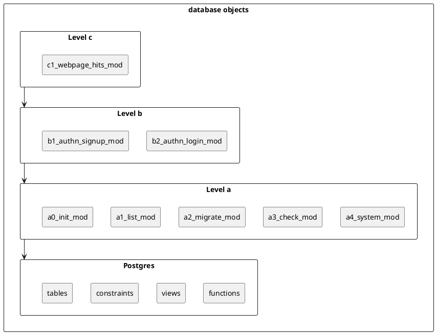

<!-- markdownlint-disable MD041 -->
[//]: # (auto_md_to_doc_comments segment start A)

# authentication_database_web_ui

[//]: # (auto_cargo_toml_to_md start)

**09. Tutorial to code authentication for database_web_ui (2022-10)**  
***version: 0.1.01 date: 2022-10-10 author: [bestia.dev](https://bestia.dev) repository: [GitHub](https://github.com/bestia-dev/authentication_database_web_ui)***  

[//]: # (auto_cargo_toml_to_md end)

[//]: # (auto_github_topics start)

 
 

[//]: # (auto_github_topics end)

[//]: # (auto_lines_of_code start)

[](https://github.com/bestia-dev/authentication_database_web_ui/)
[](https://github.com/bestia-dev/authentication_database_web_ui/)
[](https://github.com/bestia-dev/authentication_database_web_ui/)
[](https://github.com/bestia-dev/authentication_database_web_ui/)
[](https://github.com/bestia-dev/authentication_database_web_ui/)

[//]: # (auto_lines_of_code end)

 [](https://github.com/bestia-dev/authentication_database_web_ui/blob/main/LICENSE)
 

Hashtags: #rust #rustlang #tutorial  
My projects on Github are more like a tutorial than a finished product: [bestia-dev tutorials](https://github.com/bestia-dev/tutorials_rust_wasm).

## OBSOLETE

This topic is far too large for a single repository. The coding is continued in the Github organization <https://github.com/orgs/liporuwcha>

## Intro

In [previous tutorials](https://github.com/bestia-dev/refactoring_database_web_ui_server_side_rendering), we created a working prototype for a web application that can create, read, update and delete (CRUD) data in a Postgres database.  
We will continue to develop this project in the 9th part of the [Rust tutorial series](https://www.youtube.com/channel/UCitt3zFHK2jDetDh6ezI05A). Today, we will add some code for user authentication.  

## Motivation

If a web application manipulates data in a database it needs some kind of authentication. You can not leave it completely open to the internet. All kinds of nasty things can occur. It is a World Wild West out there!
Authentication is the process of recognizing the user's identity. This is later used to authorize the user to what can he/she do with the database.  

## Authentication and session cookie

The topic of authentication can get very complicated very quickly. For this tutorial, we will use a very "simple" method with sessions and cookies. It sounds old-school and it is, but it is simple, effective and it has been strengthened lately. All communication must be secured by SSL/TLS because otherwise a hacker can intercept and read secrets. The cookies MUST be SameSite to avoid nasty hacker attacks. This session cookie is a "necessary cookie" and is exempt from the European Privacy GDPR Laws.

## Signup

A new user will signup on a "user_signup page" with 3 input strings: user_email and 2 times the same password.  
The client (WASM) checks that the fields are not empty, if the user_email looks like an email, if the 2 passwords are identical and if they are complicated enough.  
The client sends the email to the server, where it checks that it does not already exist as a login and it is allowed by some rules. The server returns the salt that is just a random uuid.
The password is salted and hashed as described in the mechanism [SCRAM](https://en.wikipedia.org/wiki/Salted_Challenge_Response_Authentication_Mechanism).  
Then the client can calculates the hash with this salt. The user_email and hashed password are sent to the server. This way only the user knows the password. The administrator or hacker will see only the salted hash. The data is temporarily stored in table "user_signup".  
The server sends an email to the user with a link for verification. After verification, the record is moved to the table b2_authn_login. The use can now login.  

## Login

The user opens the "b2_authn_login" page with 2 input strings: user_email and password. The client checks that the fields are not empty and if the user_email looks like an email. The client sends the first msg to the server with the user_email. The server reads the hash from the login table and returns the salt for hashing. The client calculates the salted hash and sends it. The server checks if the hash is the same as in the database. If not, a red alert is shown.  
If successful, the server inserts a new random session_id into the table user_session and sends a cookie to the client. The session is ephemeral. It expires after 5 minutes of the last request.  

## Check session cookie

This session cookie will be attached to every request sent from this client. The server will check in the table user_session that the session_id is alive and grant access. The session_id has an expiration date_time and this is updated on every request. If the session_id expires it is deleted from the table and subsequent requests will fail. The user will need to login again. Session_id does not need to be saved in a persistent table for now. I will use some kind of cache in memory for performance. Alternatively, we could use [Redis distributed cache](https://redis.io/), which is faster than database access.

## Authorization

The main goal of authentication is authorization. We can give different users different permissions/authorizations.  
Any request from application must be authorized to ensure that the current user has appropriate permissions to make the request.
The authorization is based on the `a2_authorization_role`. Every login must be in one or more roles. The basic role is `user`.

[//]: # (auto_plantuml start)
<!-- markdownlint-disable MD033 -->
<details><summary>plantuml code:</summary>
<!-- markdownlint-enable MD033 -->


</details>


[//]: # (auto_plantuml end)

## Sending email

It is not easy to send emails over SMTP anymore because of spam. There is so much spam, that big email providers invented the "email deliverability reputation" system, which makes it difficult for smaller senders to not be flagged as spam. So the solution is to use some free email providers like MailGun, MailJet, Mailersend or Sendgrid. The email communication between a web app and its user is called "transactional email" and is specific because it needs to be fast and reliable. A "transactional email" is a type of email message that’s triggered by a specific action on a website or mobile app. Some common examples of transactional emails include password resets, account notifications, welcome emails, and any other confirmation emails that are sent via automation. These automated emails are typically sent programmatically through an email API.  
I will try Twilio Sendgrid free plan with 100 emails per day forever. Enough for developing web apps. I will be using Web API v3. I will create the json in code and send to the API point with [reqwest](https://docs.rs/reqwest/latest/reqwest/).  
First, on <http://sendgrid.com> create an API key with restricted permissions just to send emails.  
This secret will be stored in the `.env` file, but encrypted with the master_key for this application.  
The verification of my "single sender identity" was not really helpful. When I sent an email it was marked as spam. I then tried with the better "domain verification". I added the 3 CNAME records from Sendgrid to my domain dns on <http://porkbun.com>. I then used <https://mxtoolbox.com> to check the CNAME records. It is not enough to write just "bestia.dev", I needed to write the whole CNAME host "s1._domainkey.bestia.dev" or "s2._domainkey.bestia.dev". The most interesting is "em4619.bestia.dev" because the number changes for every attempt to "domain verification". Now I have verified my domain. Good. It works perfectly !


## Debugger

I want to debug the tier2 web app inside VSCode. I want to see the variables and what is going on. The debugger inside VSCode should be better than "print debugging".  
In VSCode install the extension CodeLLDB.  
The container must be run with some config that allows debugging.

```bash
--cap-add=SYS_PTRACE --security-opt seccomp=unconfined
```

I created a new "pod" with these config called "pod_with_rust_pg_vscode_debugger". The container images are unchanged by this.
Yes, the debugger needs some pretty high privileges and seccomp is disabled, but still I think that the isolation with the container is better than without it.


## Database, modules and namespaces

It is short-sighted to treat all the database as a monolith.  
Usually real life is complicated and we have different modules in the database that are developed by different teams and are loosely-coupled together. Inside one module things are very interconnected, but between different modules we try to connect them as little as possible.  
It is wise to have a strict hierarchy where higher level modules can call lower levels, but not reverse. Maybe there is some clever way to separate objects with schemas, but I will do it the old-school way. I will add a namespace prefix. It is absolutely ugly as hell, but effective. And no surprises here.  
It is also very handy for search the same name in the entire workspace with many different languages and modules. The name becomes so specific that there cannot be false positives at all.  
The lowest objects will be level "a", then "b", "c" and so on. Inside the levels the components are numbered example: a1, a2, a3...

[//]: # (auto_plantuml start)
<!-- markdownlint-disable MD033 -->
<details><summary>plantuml code:</summary>
<!-- markdownlint-enable MD033 -->



</details>


[//]: # (auto_plantuml end)


## html templates

The html files are saved in the "web_server_folder" with the same hierarchy as the Rust modules or SQL files. Again, the crucial point is to have the same unique name everywhere. Without it, we would be just lost in the sea of code.  
The html files must be saved in UTF-8 encoding without the byte-order mark (BOM).  
A lot of the html files are very similar with just a few differences. This could be optimized deduplicating the code somehow.

## secrets

I will encrypt/decrypt secrets (passwords, API secret_tokens and keys) inside the `.env` file.  
The master key will be in ~/.ssh/ directory like other private keys. The name will be webpage_hits_admin.master_key.  

```bash
nano ~/.ssh/webpage_hits_admin.master_key
chmod 600 ~/.ssh/webpage_hits_admin.master_key
```

## Other observations

If there is the problem that cargo rebuilds a bunch of dependencies over and over again, we can debug the rebuilds with the env variable:  

```bash
CARGO_LOG=cargo::core::compiler::fingerprint=info cargo build
```

## Open-source and free as a beer

My open-source projects are free as a beer (MIT license).  
I just love programming.  
But I need also to drink. If you find my projects and tutorials helpful, please buy me a beer by donating to my [PayPal](https://paypal.me/LucianoBestia).  
You know the price of a beer in your local bar ;-)  
So I can drink a free beer for your health :-)  
[Na zdravje!](https://translate.google.com/?hl=en&sl=sl&tl=en&text=Na%20zdravje&op=translate) [Alla salute!](https://dictionary.cambridge.org/dictionary/italian-english/alla-salute) [Prost!](https://dictionary.cambridge.org/dictionary/german-english/prost) [Nazdravlje!](https://matadornetwork.com/nights/how-to-say-cheers-in-50-languages/) 🍻

[//bestia.dev](https://bestia.dev)  
[//github.com/bestia-dev](https://github.com/bestia-dev)  
[//bestiadev.substack.com](https://bestiadev.substack.com)  
[//youtube.com/@bestia-dev-tutorials](https://youtube.com/@bestia-dev-tutorials)  

[//]: # (auto_md_to_doc_comments segment end A)
