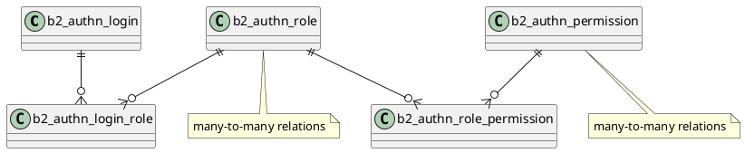
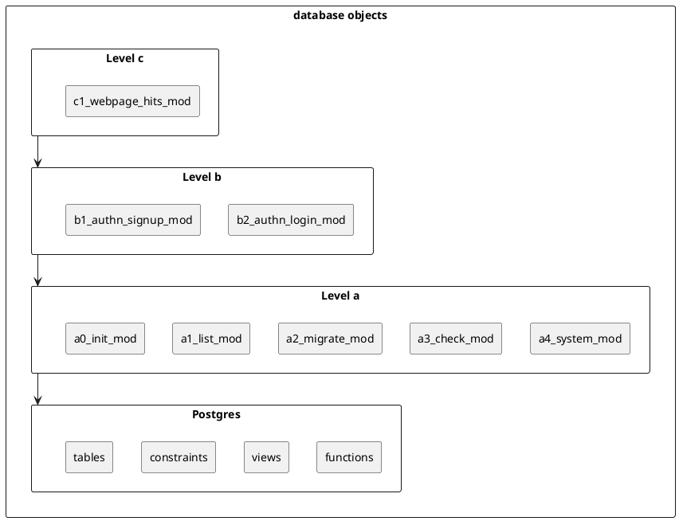

[//]: # (auto_md_to_doc_comments segment start A)

# authentication_database_web_ui

[//]: # (auto_cargo_toml_to_md start)

**09. Tutorial to code authentication for database_web_ui (2022-10)**  
***version: 0.1.01 date: 2022-10-10 author: [bestia.dev](https://bestia.dev) repository: [GitHub](https://github.com/bestia-dev/authentication_database_web_ui)***  

[//]: # (auto_cargo_toml_to_md end)

[//]: # (auto_lines_of_code start)

[](https://github.com/bestia-dev/authentication_database_web_ui/)
[](https://github.com/bestia-dev/authentication_database_web_ui/)
[](https://github.com/bestia-dev/authentication_database_web_ui/)
[](https://github.com/bestia-dev/authentication_database_web_ui/)
[](https://github.com/bestia-dev/authentication_database_web_ui/)

[//]: # (auto_lines_of_code end)

[](https://github.com/bestia-dev/authentication_database_web_ui/blob/main/LICENSE) 

Hashtags: #rust #rustlang #tutorial  
My projects on Github are more like a tutorial than a finished product: [bestia-dev tutorials](https://github.com/bestia-dev/tutorials_rust_wasm).

## Intro

In [previous tutorials](https://github.com/bestia-dev/refactoring_database_web_ui_server_side_rendering), we created a working prototype for a web application that can create, read, update and delete (CRUD) data in a Postgres database.  
We will continue to develop this project in the 9th part of the [Rust tutorial series](https://www.youtube.com/channel/UCitt3zFHK2jDetDh6ezI05A). Today, we will add some code for user authentication.  

This project has also a youtube video tutorial. Watch it:
<!-- markdownlint-disable MD033 -->
[](https://bestia.dev/youtube/authentication_database_web_ui.html)
<!-- markdownlint-enable MD033 -->

## Motivation

If a web application manipulates data in a database it needs some kind of authentication. You can not leave it completely open to the internet. All kinds of nasty things can occur. It is a World Wild West out there!
Authentication is the process of recognizing the user's identity. This is later used to authorize the user to what can he/she do with the database.  

## Authentication and session cookie

The topic of authentication can get very complicated very quickly. For this tutorial, we will use a very "simple" method with sessions and cookies. It sounds old-school and it is, but it is simple, effective and it has been strengthened lately. All communication must be secured by SSL/TLS because otherwise a hacker can intercept and read secrets. The cookies MUST be SameSite to avoid nasty hacker attacks. This session cookie is a "necessary cookie" and is exempt from the European Privacy GDPR Laws.

## Signup

A new user will signup on a "user_signup page" with 3 input strings: user_email and 2 times the same password.  
The client (WASM) checks that the fields are not empty, if the user_email looks like an email, if the 2 passwords are identical and if they are complicated enough.  
The client sends the email to the server, where it checks that it does not already exist as a login and it is allowed by some rules. The server returns the salt that is just a random uuid.
The password is salted and hashed as described in the mechanism [SCRAM](https://en.wikipedia.org/wiki/Salted_Challenge_Response_Authentication_Mechanism).  
Then the client can calculates the hash with this salt. The user_email and hashed password are sent to the server. This way only the user knows the password. The administrator or hacker will see only the salted hash. The data is temporarily stored in table "user_signup".  
The server sends an email to the user with a link for verification. After verification, the record is moved to the table b2_authn_login. The use can now login.  

## Login

The user opens the "b2_authn_login" page with 2 input strings: user_email and password. The client checks that the fields are not empty and if the user_email looks like an email. The client sends the first msg to the server with the user_email. The server reads the hash from the login table and returns the salt for hashing. The client calculates the salted hash and sends it. The server checks if the hash is the same as in the database. If not, a red alert is shown.  
If successful, the server inserts a new random session_id into the table user_session and sends a cookie to the client. The session is ephemeral. It expires after 5 minutes of the last request.  

## Check session cookie

This session cookie will be attached to every request sent from this client. The server will check in the table user_session that the session_id is alive and grant access. The session_id has an expiration date_time and this is updated on every request. If the session_id expires it is deleted from the table and subsequent requests will fail. The user will need to login again. Session_id does not need to be saved in a persistent table for now. I will use some kind of cache in memory for performance. Alternatively, we could use [Redis distributed cache](https://redis.io/), which is faster than database access.

## Authorization

The main goal of authentication is authorization. We can give different users different permissions/authorizations.  
Any request from application must be authorized to ensure that the current user has appropriate permissions to make the request.
The authorization is based on the `a2_authorization_role`. Every login must be in one or more roles. The basic role is `user`.

[//]: # (auto_plantuml start)

<details><summary>plantuml code:</summary>




[//]: # (auto_plantuml end)

## Webassembly/WASM for client code execution

We will introduce Webassembly/WASM to run code on the client inside the browser. The same could be done with Javascript, but I despise it deeply and will use Rust compiled to WASM instead.  
The client WASM will talk to the server with json messages inside POST requests bodies and response bodies. I know, this is not at all the REST standard.  

## Workspace

Rust has the concept of "workspace" to group more projects together. But it does not work well if there is a mix of server projects and WASM projects.  
This is not a standard cargo workspace. It does not have Cargo.toml in the workspace folder.
Because of one WASM project I cannot use the profile `panic="abort"` on all the members.
There is no workaround as of 2022-10.  
We can use cargo-auto to automate the tasks for every member individually.
Then we code the `automation_tasks_rs` on the workspace level to call all members tasks together.
The presence of Cargo-auto.toml or Cargo.toml is used by cargo-auto to recognize project folders.
No config exist for now for Cargo-auto.toml. Maybe one day we will add something.

## Sending email

It is not easy to send emails over SMTP anymore because of spam. There is so much spam, that big email providers invented the "email deliverability reputation" system, which makes it difficult for smaller senders to not be flagged as spam. So the solution is to use some free email providers like MailGun, MailJet, Mailersend or Sendgrid. The email communication between a web app and its user is called "transactional email" and is specific because it needs to be fast and reliable. A "transactional email" is a type of email message that’s triggered by a specific action on a website or mobile app. Some common examples of transactional emails include password resets, account notifications, welcome emails, and any other confirmation emails that are sent via automation. These automated emails are typically sent programmatically through an email API.  
I will try Twilio Sendgrid free plan with 100 emails per day forever. Enough for developing web apps. I will be using Web API v3. I will create the json in code and send to the API point with [reqwest](https://docs.rs/reqwest/latest/reqwest/).  
First, on <http://sendgrid.com> create an API key with restricted permissions just to send emails.  
This secret will be stored in env variable and available to my web app:

```bash
 export SENDGRID_API_KEY="SG.my.api.key"
```

The verification of my "single sender identity" was not really helpful. When I sent an email it was marked as spam. I then tried with the better "domain verification". I added the 3 CNAME records from Sendgrid to my domain dns on <http://porkbun.com>. I then used <https://mxtoolbox.com> to check the CNAME records. It is not enough to write just "bestia.dev", I needed to write the whole CNAME host "s1._domainkey.bestia.dev" or "s2._domainkey.bestia.dev". The most interesting is "em4619.bestia.dev" because the number changes for every attempt to "domain verification". Now I have verified my domain. Good. It works perfectly !

## Early return

The programming concept of "early return" makes the code much more readable. The "happy path" goes straight through the code till the end of the function. If something is wrong we make an early return from the function. The new language construct "let else statement" is great for this. It is syntactical sugar for match and simplifies some very common error-handling patterns. Before that we had the "if let" and "match" constructs, but they both force "rightward drift" introduce excessive nesting.
It was added just a few days ago in the rustc version 1.65.0. Nice!  
Even better is to use the operator "?" for early return where possible. It is very concise and readable.

## Debugger

I want to debug the tier2 web app inside VSCode. I want to see the variables and what is going on. The debugger inside VSCode should be better than "print debugging".  
In VSCode install the extension CodeLLDB.  
The container must be run with some config that allows debugging.

```bash
--cap-add=SYS_PTRACE --security-opt seccomp=unconfined
```

I created a new "pod" with these config called "pod_with_rust_pg_vscode_debugger". The container images are unchanged by this.
Yes, the debugger needs some pretty high privileges and seccomp is disabled, but still I think that the isolation with the container is better than without it.

## PostgreSql aka Postgres

I didn't want to talk much about databases, but there are personal opinions I cannot hold inside.  
I am new to Postgres, exactly Postgres 13. I come with 20 years of experience with Microsoft SQL server.  
I think Postgres is an incredible Open Source project and I love it. But there are things new (and old) developers must be careful.  

## Function overloading

I despise function overloading in PL/pgSQL. It is a bad idea. Sadly it is impossible to disable. The developer has the burden to be careful. Awful.

## case-sensitive

By default Postgres is case-sensitive. That makes absolute sense for performance. Computers really don't care if "A" is the uppercase of "a". For the computer the first is just the number "65" and the later is the number "97". It is easy to compare this numbers and they are different. End of story.  
Not quite. For us humans they are the same letter, just in uppercase or lowercase. When we order words in a dictionary we (mostly) want to treat them as the same letter. There is code outside the ASCII table that makes this connection. It is very simple for the computerish English language. You can use the comparison after changing to lowercase: `lower('A')=lower('a')`. It works. Great.  
The sql code and object names in Postgres are also case-sensitive, but they use a trick! Before actually using the code and names they make them lowercase silently in the background. So you can name an object "LaLa", but it will be stored as "lala". Later you can retrieve this object as "LaLa", but in reality the engine will search for the object "lala". Smart trick.  
I personally want my code to be as truthful as possible and these tricks are just messing with my code. So I prefer to write the code and names in their true form all in lowercase.  

## unicode collations and utf-8 encoding

What about user text content?  
Don't forget there are more than 7000 spoken languages in the world right now. Most of them want to work something with computers and databases in their language. It is soon overwhelmingly complicated when you need to work with "strange" languages that are not super-similar to English. Just imagine Chinese characters.  
Unicode to the rescue.  
Unicode is more than just mapping of graphemes to a unique number. It is a deep rabbit hole of understanding the few rules and many exceptions of most languages. These rules are often  disputed and controversial and change over time.  
The part of the story that compares and orders letters in a language/culture is called "collation".  
The part of unicode that can write and read to a computer file is called "encoding". The preferred encoding is "utf-8". It is ingenious !  
Postgres 13 can use collations. Every text/char/varchar column can have a different collation. That sounds good. But I am afraid that using collation we loose the use of the LIKE operator. And I like the LIKE operator !  
I will try and see going forward.  

## SQL language

SQL is the very old standard language for database manipulation (DDL and DML). It is great and easy. But it is also terrible.  
Sql has a terrifyingly incoherent syntax and the same thing can be written in so many ways.
Many tried to create an auto-complete query editor, but it is still a failure, because of the language.  
Sql code can be written in so complicated ways that is impossible to maintain it later. This is a big no-no.  
My First rule of SQL: keep it as simple as possible. Use a limited set of data-types, objects and rules. Keep the syntax as uniform as possible.  
Nobody can or will enforce this and the temptation to make abstract-art code that nobody can maintain is strong.  
Backward compatibility is the killer of readability. I understand that old projects must be maintained with the same "version" of the language they were created. But please let the new projects start with the "fresh new version" that deprecates many old things nobody uses any more. It would be nice for newcomers to have just one easy and simple choice how to write things. A newcomer cannot choose "the best" option from many, because he has no experience. We could give him an easy start deprecating what is not considered "best practice" any more.  
Sadly humans can never agree on anything if it is a matter of aesthetic or opinion. On purpose we wait somebody says something and we say the opposite thing! Then we stick with this opinion for ever. Just so, on purpose!  
Uppercase letters for reserved words was a smart thing back in 1970s. But today we have all editors with color syntax highlighting and the old standard is really hard to type. I choose to just code all in lowercase also because that is anyway what postgres internally transforms the code. Different tastes, different opinions, same technical result. We will never agree.  
I like to alias tables in sql queries with one or two letters. I would make it mandatory for all queries, including delete and update. But I cannot.  
I don't see a reason to have the redundant words inner and outer for joins. Everything is crystal clear with join, left join and right join.  
It is not nice to have many columns listed in the same line. It is also not nice to have many columns listed each one on a separate line. The truth is somewhere in between. Maybe 5 columns per line? Maybe column of one table in one line and columns of other table in the other line? There is no answer to that.  
After join what table column should be on the left side of the comparison. For me it is "logical" the new table is compared with the old table. But somebody thinks exactly the opposite.  
What to use for non-equal: the standard old-school "<>" or the C influenced "!="?
What is the best name for the type: integer, int or int4 ?
What about the varchar, char varying or character varying ?
It is a mess. Does it need to be? No. We just need a benevolent dictator. But nobody has the courage and charisma to be. We wait in a limbo for better days.  

## Migration or schema update

The sql language or postgres don't have anything useful for database migration. Migration is the term used when we need to update the schema, add tables or columns, views or functions. This is not just an option, the migration is unavoidable when we iteratively develop a database application. Third party solutions are just terrible.
So the first thing I did, is to create a small set of views and functions that can be called a "migration mechanism". It is super simplistic, made entirely inside the postgres database, but good enough for this tutorial.  
Can you imagine that postgres does not store the original code for views and functions? It is or distorted or just partial. Unusable. So the first thing I need is a table to store the exact installed source code `a2_source_code`. That way I can check if the "new" source code is already installed and not install unchanged code. This is not perfect because I cannot (easily) forbid to install things manually and not store it in a2_source_code, but that is "bad practice" and I hope all developers understand the importance of discipline when working with a delicate system like a database.
After I update database objects in development, I need to be able to repeat this changes as a migration in the production database.  
I will use backup/restore to revert the developer database to the same situation as the production database and test the migration many times. The migrate command is a bash script. It is omnipotent. I just run that script and it must do the right thing in any situation.  
There are different objects that need different approaches.  
A table is made of columns. The first column is usually the primary key of the table. I start creating the new table only with the first column. It is a new empty table, it takes no time at all. It is very difficult later to change this first column, so I will not upgrade this automatically.  
The rest of the columns are installed one by one. Why? Because if one column changes later, we have a place to change it independently from other columns. There are limits what and how we can change it when it contains data, but that is the job of the developer: to understand the data and the mechanisms how to upgrade. It is not easy and cannot be automated.  Usually it is made in many steps, not just in one step. Complicated.  
When writing code always be prepared that a column can be added anytime. This must not disrupt the old code. Deleting or changing a column is much more complicated and needs change to all dependent code.
Unique keys and foreign keys MUST be single-column for our sanity. Technically is very simple to do a multi-column key, but maintaining that code in a huge database is terrible. Sooner or later also your database will become huge. That is just how evolution works. Unstoppable.  
One table can have foreign keys to another table. The later must be installed first. The order of installing objects is important.  
All modification of data must be done with sql functions. Never call update/insert/delete directly from outside of the database. Slowly but surely, a different module in another language on another server will need the same functionality and the only way to have it in common is to have it on the database level.
I write my sql code in VSCode. Every object is a separate file. This makes it easy to use Git as version control. Every file is prepared for the migration mechanism and can be called from psql or within VSCode with Ctrl-EE (yes double E) with the extensions SQLTools and SQLTools PostgreSQL.  
Then I write bash scripts that call psql to run this sql files in the correct order. That is my super-simple "migration mechanism". Good enough.

## Database, modules and namespaces

It is short-sighted to treat all the database as a monolith.  
Usually real life is complicated and we have different modules in the database that are developed by different teams and are loosely-coupled together. Inside one module things are very interconnected, but between different modules we try to connect them as little as possible.  
It is wise to have a strict hierarchy where higher level modules can call lower levels, but not reverse. Maybe there is some clever way to separate objects with schemas, but I will do it the old-school way. I will add a namespace prefix. It is absolutely ugly as hell, but effective. And no surprises here.  
It is also very handy for search the same name in the entire workspace with many different languages and modules. The name becomes so specific that there cannot be false positives at all.  
The lowest objects will be level "a", then "b", "c" and so on. Inside the levels the components are numbered example: a1, a2, a3...

[//]: # (auto_plantuml start)
<details><summary>plantuml code:</summary>



</details>


[//]: # (auto_plantuml end)

## html templates

The html files are saved in the "web_server_folder" with the same hierarchy as the Rust modules or SQL files. Again, the crucial point is to have the same unique name everywhere. Without it, we would be just lost in the sea of code.  
The html files must be saved in UTF-8 encoding without the byte-order mark (BOM).  
A lot of the html files are very similar with just a few differences. This could be optimized deduplicating the code somehow.

## Other observations

If there is the problem that cargo rebuilds a bunch of dependencies over and over again, we can debug the rebuilds with the env variable:  

```bash
CARGO_LOG=cargo::core::compiler::fingerprint=info cargo build
```

## cargo crev reviews and advisory

We live in times of danger with [supply chain attacks](https://en.wikipedia.org/wiki/Supply_chain_attack).  
It is recommended to always use [cargo-crev](https://github.com/crev-dev/cargo-crev) to verify the trustworthiness of each of your dependencies.  
Please, spread this info.  
You can also read crev reviews quickly on the web:  
<https://web.crev.dev/rust-reviews/crates/>  

## open-source and free as a beer

My open-source projects are free as a beer (MIT license).  
I just love programming.  
But I need also to drink. If you find my projects and tutorials helpful, please buy me a beer by donating on my [Paypal](https://paypal.me/LucianoBestia).  
You know the price of a beer in your local bar ;-) So I can drink a free beer for your health :-)  

[Na zdravje!](https://translate.google.com/?hl=en&sl=sl&tl=en&text=Na%20zdravje&op=translate) [Alla salute!](https://dictionary.cambridge.org/dictionary/italian-english/alla-salute) [Prost!](https://dictionary.cambridge.org/dictionary/german-english/prost) [Nazdravlje!](https://matadornetwork.com/nights/how-to-say-cheers-in-50-languages/) 🍻

[//]: # (auto_md_to_doc_comments segment end A)
